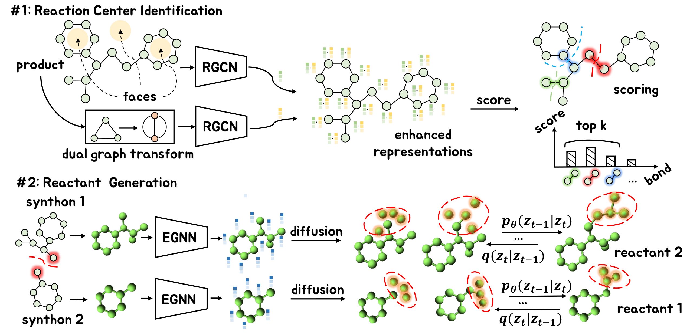

## GDiffRetro: Retrosynthesis Prediction with Dual Graph Enhanced Molecular Representation and Diffusion Generation


[](https://arxiv.org/abs/2501.08001)
[](https://aaai.org/conference/aaai/aaai-25/)
[](https://pytorch.org/)
  

This is the Pytorch implementation for our *AAAI'25* paper: [**GDiffRetro: Retrosynthesis Prediction with Dual Graph Enhanced Molecular Representation and Diffusion Generation**](https://arxiv.org/abs/2501.08001). 

## Abstract
<div style="text-align: justify;">
Retrosynthesis prediction focuses on identifying reactants capable of synthesizing a target product. Typically, the retrosynthesis prediction involves two phases: Reaction Center Identification and Reactant Generation. However, we argue that most existing methods suffer from two limitations in the two phases: (i) Existing models do not adequately capture the ``face'' information in molecular graphs for the reaction center identification. (ii) Current approaches for the reactant generation predominantly use sequence generation in a 2D space, which lacks versatility in generating reasonable distributions for completed reactive groups and overlooks molecules' inherent 3D properties. To overcome the above limitations, we propose GDiffRetro. For the reaction center identification, GDiffRetro uniquely integrates the original graph with its corresponding dual graph to represent molecular structures, which helps guide the model to focus more on the faces in the graph. For the reactant generation, GDiffRetro employs a conditional diffusion model in 3D to further transform the obtained synthon into a complete reactant. Our experimental findings reveal that GDiffRetro outperforms state-of-the-art semi-template models across various evaluative metrics. The overall framework is as follows:
<div> 
<br>



# Requirement
The conda environment
```shell
conda install -c conda-forge rdkit python==3.9
```
Install neccesary packages
```shell
torch==1.11.0+cu113  
torch-cluster==1.6.3  
torch-scatter==2.0.9  
openbabel  
wandb
```
> Note that we use a modified torchdrug in `./stage1` so you needn't install it with `pip install torchdrug`.
> More details about the environment are provided in ./requirement.txt.
# Run
## Stage 0: Data Process
```shell
cd code/known_class/  # cd code/unknown_class/  
cd stage1/data_prcocess/generate_SDF/
python main.py
cd stage1/data_prcocess/get_dataset_1st_stage/
python main.py
```
## Stage 1: Reaction Center Identification
```shell
cd stage1 
python train.py
python stage1_to_result_dict.py --sample_times 300 --checkpoint model/reaction_center_model_w_class.pth
# python stage1_to_result_dict.py --sample_times 300 --checkpoint model/reaction_center_model_wo_class.pth
```
## Stage 2: Synthon Completion
```shell 
cd stage2  
python train_gdiffretro.py
python train_size_gnn.py
bash run_get_results.sh
```
> We provide the dataset and checkpoints [here](https://portland-my.sharepoint.com/:f:/g/personal/shengysun4-c_my_cityu_edu_hk/EoZzeoHajTFDpgKrnsdI7xsB5Hpls0u9kHDUKdqa1MrEnA?e=I2NmXZ).

## Acknowledgment of Open-Source Code Contributions  

  The code is based on the open-source repositories: [TorchDrug](https://github.com/DeepGraphLearning/torchdrug), [DeLinker](https://github.com/oxpig/DeLinker), and [DiffLinker](https://github.com/igashov/DiffLinker), many thanks to the authors! 

You are welcome to cite our paper:
```
@inproceedings{SunYu25,
  title={GDiffRetro: Retrosynthesis Prediction with Dual Graph Enhanced Molecular Representation and Diffusion Generation},
  author={Sun, Shengyin and Yu, Wenhao and Ren, Yuxiang and Du, Weitao and Liu, Liwei and Zhang, Xuecang and Hu, Ying and Ma, Chen},
  booktitle={arXiv:2501.08001},
  year={2025}
}
```
